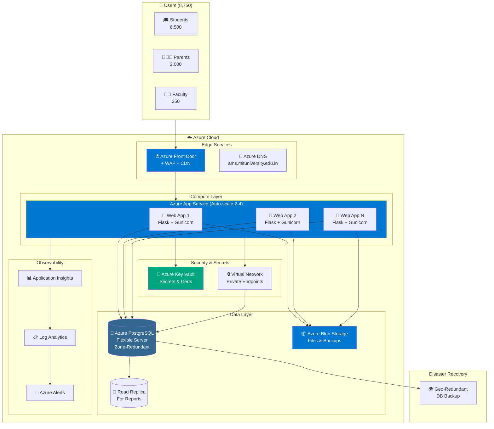

# EduMatrix-AMS Azure Infrastructure Requirements

## Executive Summary

| Metric | Value |
|--------|-------|
| Total Users | ~8,750 (6,500 students + 2,000 parents + 250 faculty) |
| Expected Peak Concurrent Users | 1,500 - 2,000 (during attendance/exam periods) |
| Application Type | Web Application (Flask/Python) + PostgreSQL |
| Deployment Model | Docker Containers |
| Availability Target | 99.9% uptime |

---

## 1. User Load Analysis

### User Distribution
| User Type | Count | Peak Usage Pattern |
|-----------|-------|-------------------|
| Students | 6,500 | Morning classes (8-10 AM), Lab sessions |
| Parents | 2,000 | Evening hours (6-9 PM), Report card periods |
| Faculty | 250 | Throughout day (8 AM - 6 PM), Attendance marking |

### Concurrent User Estimation
| Scenario | Concurrent Users | Requests/sec |
|----------|------------------|--------------|
| Normal Day | 500 - 800 | 50-100 |
| Peak Hours (Attendance) | 1,500 - 2,000 | 200-300 |
| Exam Results Day | 3,000 - 4,000 | 500-800 |
| Stress Test Target | 5,000 | 1,000 |

---

## 2. Recommended Azure Architecture

### Architecture Diagram (Mermaid)



### Text Diagram (Fallback)

```
                                    ┌─────────────────────────────────────────────────────────────┐
                                    │                    Azure Cloud                               │
                                    │                                                              │
┌──────────┐    ┌──────────────┐   │  ┌─────────────────────────────────────────────────────┐    │
│          │    │              │   │  │              Azure App Service / AKS                 │    │
│  Users   │───▶│ Azure Front  │───│──│  ┌─────────┐  ┌─────────┐  ┌─────────┐             │    │
│ (8,750)  │    │    Door      │   │  │  │ Web App │  │ Web App │  │ Web App │  (Auto-scale)│    │
│          │    │   + WAF      │   │  │  │ Node 1  │  │ Node 2  │  │ Node N  │             │    │
└──────────┘    └──────────────┘   │  │  └────┬────┘  └────┬────┘  └────┬────┘             │    │
                                    │  └───────┼───────────┼───────────┼───────────────────┘    │
                                    │          │           │           │                         │
                                    │          └───────────┴───────────┘                         │
                                    │                      │                                      │
                                    │          ┌───────────▼───────────┐                         │
                                    │          │   Azure Database      │                         │
                                    │          │   for PostgreSQL      │                         │
                                    │          │   (Flexible Server)   │                         │
                                    │          └───────────────────────┘                         │
                                    │                                                              │
                                    │          ┌───────────────────────┐                         │
                                    │          │   Azure Blob Storage  │                         │
                                    │          │   (Files, Backups)    │                         │
                                    │          └───────────────────────┘                         │
                                    └─────────────────────────────────────────────────────────────┘
```

---

## 3. Compute Resources

### Option A: Azure App Service (Recommended for Simplicity)

| Component | SKU | Specification | Monthly Cost (Est.) |
|-----------|-----|---------------|---------------------|
| App Service Plan | P2v3 | 4 vCPU, 16 GB RAM | ~$250/month |
| Instances | 2-4 (auto-scale) | Min: 2, Max: 4 | ~$500-1000/month |

**Configuration:**
```yaml
App Service Plan:
  Tier: PremiumV3
  Size: P2v3
  OS: Linux
  
Auto-scale Rules:
  - Scale out when CPU > 70% for 5 min
  - Scale out when Memory > 80% for 5 min
  - Scale in when CPU < 30% for 10 min
  - Minimum instances: 2
  - Maximum instances: 4
```

### Option B: Azure Kubernetes Service (For Complex Deployments)

| Component | Specification | Monthly Cost (Est.) |
|-----------|---------------|---------------------|
| AKS Cluster | Standard_D4s_v3 (4 vCPU, 16GB) | ~$150/node |
| Node Pool | 3-6 nodes (auto-scale) | ~$450-900/month |
| Load Balancer | Standard | ~$20/month |

---

## 4. Database Requirements

### Azure Database for PostgreSQL - Flexible Server

| Parameter | Recommended Value | Justification |
|-----------|-------------------|---------------|
| **Tier** | General Purpose | Balanced performance |
| **Compute** | Standard_D4ds_v4 | 4 vCPU, 16 GB RAM |
| **Storage** | 256 GB (expandable) | Initial + growth buffer |
| **IOPS** | 1,200 (auto-scale) | Peak load handling |
| **Backup Retention** | 35 days | Compliance requirement |
| **High Availability** | Zone-redundant | 99.99% SLA |
| **Read Replica** | 1 (for reports) | Offload read queries |

**Estimated Monthly Cost:** ~$400-600/month

### Database Sizing Estimation

| Table | Estimated Rows | Estimated Size |
|-------|----------------|----------------|
| user_master | 8,750 | 5 MB |
| student_profile | 6,500 | 20 MB |
| staff_profile | 250 | 1 MB |
| parent_profile | 2,000 | 5 MB |
| attendance_transaction | 6,500 × 180 days × 6 periods = 7M/year | 2 GB/year |
| weekly_schedule | 10,000 | 10 MB |
| ca_marks | 6,500 × 10 subjects × 4 exams = 260K/year | 100 MB/year |
| **Total (Year 1)** | | **~5 GB** |
| **Projected (5 Years)** | | **~25-30 GB** |

---

## 5. Storage Requirements

### Azure Blob Storage

| Purpose | Estimated Size | Storage Tier | Monthly Cost |
|---------|----------------|--------------|--------------|
| Session files | 1 GB | Hot | ~$0.02/GB |
| File uploads (documents) | 50 GB | Hot | ~$1/month |
| Database backups | 100 GB | Cool | ~$1/month |
| Logs archive | 50 GB | Archive | ~$0.10/month |
| **Total** | **200 GB** | | **~$5/month** |

---

## 6. Networking

### Azure Front Door + WAF (Web Application Firewall)

| Feature | Specification |
|---------|---------------|
| **Tier** | Standard |
| **WAF Policy** | OWASP 3.2 rule set |
| **DDoS Protection** | Basic (included) |
| **SSL/TLS** | Managed certificate |
| **Custom Domain** | ams.mituniversity.edu.in |
| **Caching** | Static assets (CSS, JS, images) |

**Estimated Cost:** ~$35-50/month

### Virtual Network

```yaml
VNet Configuration:
  Address Space: 10.0.0.0/16
  
  Subnets:
    - app-subnet: 10.0.1.0/24 (App Service Integration)
    - db-subnet: 10.0.2.0/24 (PostgreSQL Private Endpoint)
    - management-subnet: 10.0.3.0/24 (Bastion, monitoring)
  
  Network Security Groups:
    - Allow HTTPS (443) from Internet to App
    - Allow PostgreSQL (5432) from App to DB only
    - Deny all other inbound
```

---

## 7. Security Requirements

### Azure Active Directory (Optional SSO)
- Integrate with university AD for faculty/staff SSO
- Student login via application credentials

### Key Vault
| Secret | Purpose |
|--------|---------|
| DATABASE_URL | PostgreSQL connection string |
| SECRET_KEY | Flask session encryption |
| FIREBASE_CREDENTIALS | Push notifications |

### Security Features Checklist
- [x] WAF with OWASP rules
- [x] Private endpoints for database
- [x] Managed SSL certificates
- [x] Azure Defender for App Service
- [x] Network Security Groups
- [x] Azure Key Vault for secrets
- [x] Audit logging enabled

---

## 8. Monitoring & Observability

### Azure Monitor + Application Insights

| Metric | Alert Threshold | Action |
|--------|-----------------|--------|
| Response Time | > 2 seconds (avg 5 min) | Email + Scale out |
| Error Rate | > 1% | Email + PagerDuty |
| CPU Usage | > 80% (5 min) | Auto-scale |
| Database Connections | > 80% of max | Email |
| Failed Logins | > 50/hour | Security alert |

### Log Analytics Workspace
- Application logs retention: 30 days
- Security logs retention: 90 days
- Audit logs retention: 365 days

**Estimated Cost:** ~$50-100/month

---

## 9. Backup & Disaster Recovery

### Backup Strategy

| Component | Backup Frequency | Retention | RPO | RTO |
|-----------|------------------|-----------|-----|-----|
| PostgreSQL | Continuous + Daily | 35 days | 5 min | 1 hour |
| Blob Storage | Daily snapshot | 30 days | 24 hours | 4 hours |
| App Configuration | Git-based | Unlimited | 0 | 30 min |

### Disaster Recovery

| Tier | Configuration | RTO | Cost Impact |
|------|---------------|-----|-------------|
| Basic | Single region, zone-redundant DB | 4 hours | Baseline |
| Standard | Geo-redundant DB backup | 2 hours | +20% |
| Premium | Multi-region active-passive | 30 min | +100% |

**Recommendation:** Standard tier for educational institution

---

## 10. Environment Setup

### Required Environments

| Environment | Purpose | Sizing | Monthly Cost |
|-------------|---------|--------|--------------|
| Production | Live system | Full spec | ~$1,200-1,500 |
| Staging | Pre-release testing | 50% of prod | ~$400-500 |
| Development | Development/testing | Minimal | ~$100-150 |

---

## 11. Cost Summary

### Monthly Cost Breakdown (Production)

| Service | Configuration | Monthly Cost (USD) |
|---------|---------------|-------------------|
| App Service | P2v3 × 2 instances | $500 |
| PostgreSQL Flexible | D4ds_v4, 256GB, HA | $500 |
| Azure Front Door + WAF | Standard | $50 |
| Blob Storage | 200 GB | $10 |
| Azure Monitor | Application Insights | $75 |
| Key Vault | Standard | $5 |
| Virtual Network | Basic | $10 |
| **Subtotal** | | **$1,150** |
| **+ 20% Buffer** | Unexpected usage | $230 |
| **Total Monthly** | | **~$1,380/month** |
| **Annual Cost** | | **~$16,560/year** |

### Cost Optimization Recommendations
1. **Reserved Instances** - 1-year commitment saves ~30% ($11,600/year)
2. **Dev/Test Pricing** - Use for non-production (~50% savings)
3. **Auto-shutdown** - Staging/Dev off hours
4. **Right-sizing** - Monitor and adjust after 3 months

---

## 12. Implementation Timeline

| Phase | Duration | Activities |
|-------|----------|------------|
| **Phase 1: Setup** | Week 1-2 | VNet, Key Vault, PostgreSQL, Blob Storage |
| **Phase 2: Deploy** | Week 3 | App Service, Docker deployment, DNS |
| **Phase 3: Security** | Week 4 | WAF, SSL, monitoring, backup verification |
| **Phase 4: Testing** | Week 5-6 | Load testing, UAT, security audit |
| **Phase 5: Go-Live** | Week 7 | DNS cutover, monitoring, support |

---

## 13. Azure Resource Names (Suggested)

```
Resource Group: rg-edumatrix-ams-prod
App Service Plan: asp-edumatrix-prod
App Service: app-edumatrix-ams-prod
PostgreSQL: psql-edumatrix-prod
Storage Account: stedumatrixamsprod
Key Vault: kv-edumatrix-prod
Front Door: fd-edumatrix-prod
VNet: vnet-edumatrix-prod
Log Analytics: log-edumatrix-prod
Application Insights: appi-edumatrix-prod
```

---

## 14. Prerequisites from IT Team

1. **Azure Subscription** with sufficient quota
2. **Custom Domain** - ams.mituniversity.edu.in (DNS access)
3. **SSL Certificate** - Or use Azure-managed
4. **Service Principal** - For CI/CD deployment
5. **Network Team Coordination** - For DNS and firewall rules

---

## 15. Support & SLA

| Azure SLA | Availability |
|-----------|--------------|
| App Service (P-tier) | 99.95% |
| PostgreSQL Flexible (Zone-redundant) | 99.99% |
| Azure Front Door | 99.99% |
| **Composite SLA** | **~99.93%** |

**Maximum Expected Downtime:** ~6.1 hours/year

---

## Contact for Technical Queries

For application-specific questions, contact the development team.
For Azure infrastructure, consult Microsoft Azure documentation or Azure support.

---

*Document Version: 1.0*  
*Last Updated: December 24, 2025*
